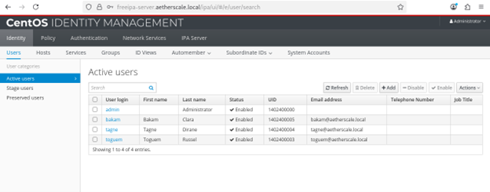

# FreeIPA Cross-Platform Deployment

A documented FreeIPA lab environment for centralizing authentication, authorization, and SSH key management across Linux and Windows systems.

## Table of Contents
- [Overview](#overview)
- [Architecture](#architecture)
- [Prerequisites](#prerequisites)
- [Server Deployment](#server-deployment)
- [Client Enrollment](#client-enrollment)
  - [Ubuntu Server](#ubuntu-server)
  - [CentOS Stream 9](#centos-stream-9)
  - [Windows 10](#windows-10)
- [Identity Management](#identity-management)
- [Sudo Policy Management](#sudo-policy-management)
- [SSH Key Management](#ssh-key-management)
- [Verification](#verification)
- [Repository Layout](#repository-layout)
- [Notes](#notes)

## Overview
This repository describes a FreeIPA deployment used to manage user identities, group membership, sudo rules, and SSH public keys for a mixed operating system environment.

## Architecture
- **FreeIPA server:** CentOS Stream 9
- **Ubuntu server:** Ubuntu 22.04 with BigBlueButton installed
- **CentOS client:** CentOS Stream 9
- **Windows client:** Windows 10


## Prerequisites
- DNS resolution for all hosts in the FreeIPA domain
- Static IP addresses or stable DHCP reservations
- Time synchronization between server and clients
- Administrative access to each host
- Firewall ports open for FreeIPA services

## Server Deployment
### Prepare the FreeIPA server
- Configure the server hostname
- Validate DNS and `/etc/hosts` entries
- Confirm connectivity from client systems

### Install and configure FreeIPA
Install the server packages and complete the FreeIPA configuration wizard.

### Firewall configuration
```bash
sudo firewall-cmd --add-port={80,443,389,636,88,53}/tcp --permanent
sudo firewall-cmd --add-port={88,464,53,123}/udp --permanent
sudo firewall-cmd --add-service=free-ldap --add-service=freeipa-ldaps --permanent
sudo firewall-cmd --reload
```

### Documentation and verification


## Client Enrollment

### Ubuntu Server
1. Add the Ubuntu host DNS record:
```bash
ipa dnsrecord-add aetherscale.local bbb-server --a-rec 192.168.62.158
```
2. Set the hostname:
```bash
sudo hostnamectl set-hostname bbb-server.aetherscale.local
hostname -f
```
3. Update `/etc/hosts` and `/etc/resolv.conf` to use the FreeIPA DNS server.
4. Install and enroll the FreeIPA client:
```bash
sudo apt-get update
sudo apt-get install -y freeipa-client
sudo ipa-client-install
```

### Ubuntu screenshots


### CentOS Stream 9
1. Install FreeIPA client packages:
```bash
sudo dnf install -y freeipa-client
```
2. Configure the hostname:
```bash
sudo hostnamectl set-hostname centos.aetherscale.local
hostname -f
```
3. Enroll the client with home directory creation:
```bash
sudo ipa-client-install --mkhomedir
```

### CentOS screenshots


### Windows 10
1. Register the Windows host in FreeIPA using the web UI or CLI.
2. Generate the Windows host keytab on the FreeIPA server:
```bash
sudo ipa-getkeytab -s freeipa-server.aetherscale.local \
  -p host/windows.aetherscale.local \
  -e aes256-cts,aes128-cts,aes256-sha2,aes128-sha2 \
  -k /etc/krb5.keytab -P
sudo klist -k
```
3. Configure Windows Kerberos domain settings:
```powershell
ksetup /setdomain AETHERSCALE.LOCAL
ksetup /addkdc AETHERSCALE.LOCAL freeipa-server.aetherscale.local
ksetup /addkpasswd AETHERSCALE.LOCAL freeipa-server.aetherscale.local
ksetup /setcomputerpassword admin123
ksetup /mapuser * *
```

### Windows screenshots


## Identity Management
### Create users
Use the FreeIPA web UI to create and manage user accounts:
1. Open the FreeIPA web UI.
2. Navigate to `Identity > Users`.
3. Click `Add` and complete the required fields.

### Manage groups
Create groups and assign users.
```bash
ipa group-add junior-devs --desc="Junior Developers"
ipa group-add senior-ops --desc="Senior Operations"
ipa group-add-member junior-devs --users=bakam
ipa group-add-member senior-ops --users=toguem
```

### Identity screenshots




## Sudo Policy Management
### Define sudo rules
```bash
ipa sudorule-add junior-dev-rule
ipa sudorule-add senior-ops-rule
```

### Junior developers: log read access only
```bash
ipa sudocmd-add "/bin/cat /var/log/*"
ipa sudorule-add-allow-command junior-dev-rule --sudocmds="/bin/cat /var/log/*"
ipa sudorule-add-user junior-dev-rule --groups=junior-devs
```

### Senior operations: service restart access
```bash
ipa sudocmd-add "/bin/systemctl restart *"
ipa sudorule-add-allow-command senior-ops-rule --sudocmds="/bin/systemctl restart *"
ipa sudorule-add-user senior-ops-rule --groups=senior-ops
```

### Sudo screenshots


## SSH Key Management
### Generate SSH key pair
```bash
ssh-keygen -t ed25519 -C "bakam@aetherscale.local"
```

### Add public key to FreeIPA
```bash
ipa user-mod bakam --sshpubkey="$(cat ~/.ssh/id_ed25519.pub)"
```

### Configure SSH to use SSSD
Edit `/etc/ssh/sshd_config` and add:
```text
AuthorizedKeysCommand /usr/bin/sss_ssh_authorizedkeys
AuthorizedKeysCommandUser root
PasswordAuthentication no
ChallengeResponseAuthentication no
PubkeyAuthentication yes
UsePAM yes
```

### Apply SSH configuration
```bash
sudo sshd -t
sudo systemctl restart sshd
```

### SSH screenshots


## Verification
- Confirm hosts are visible in the FreeIPA host inventory.
- Validate user authentication from each client.
- Test sudo access for configured groups.
- Confirm SSH login using FreeIPA-managed keys.

## Repository Layout
- `README.md` — primary project documentation
- `images/` — screenshots and visual documentation
- `readme_template.docx` — raw planning document
- `scenario_1.docx` — scenario documentation
- `.gitignore` — ignore rules for temporary files

## Notes
- Keep an active administrative session when updating SSH configuration.
- Use both the FreeIPA web UI and CLI for verification.
- Replace example hostnames and domains with values from your own environment.
