# FreeIPA Cross-Platform Deployment

[](https://opensource.org/licenses/MIT)

A comprehensive, documented FreeIPA lab environment for centralizing authentication, authorization, and SSH key management across Linux and Windows systems. This project demonstrates advanced system administration skills, including identity management, cross-platform integration, and enterprise security practices.

## Table of Contents
- [Overview](#overview)
- [Features](#features)
- [Architecture](#architecture)
- [Technologies Used](#technologies-used)
- [Prerequisites](#prerequisites)
- [Installation](#installation)
- [Client Enrollment](#client-enrollment)
  - [Ubuntu Server](#ubuntu-server)
  - [CentOS Stream 9](#centos-stream-9)
  - [Windows 10](#windows-10)
- [Identity Management](#identity-management)
- [Sudo Policy Management](#sudo-policy-management)
- [SSH Key Management](#ssh-key-management)
- [Verification](#verification)
- [Contributing](#contributing)
- [License](#license)
- [Notes](#notes)

## Overview
This repository provides a detailed guide and configuration for deploying FreeIPA, an open-source identity management system, in a mixed operating system environment. It showcases expertise in enterprise-level authentication, user management, and secure access control across Linux (Ubuntu, CentOS) and Windows platforms. Ideal for demonstrating skills in system administration, network security, and DevOps practices.

## Features
- **Centralized Identity Management**: Unified user and group management across multiple OS platforms.
- **Cross-Platform Authentication**: Seamless login and authorization for Linux and Windows clients.
- **SSH Key Management**: Automated distribution and revocation of SSH public keys.
- **Sudo Policy Enforcement**: Role-based access control for privileged commands.
- **DNS Integration**: Built-in DNS server for domain resolution.
- **Web-Based Administration**: User-friendly GUI for managing identities and policies.
- **Security Best Practices**: Kerberos authentication, LDAP integration, and encrypted communications.

## Architecture
- **FreeIPA server:** CentOS Stream 9
- **Ubuntu server:** Ubuntu 22.04 with BigBlueButton installed
- **CentOS client:** CentOS Stream 9
- **Windows client:** Windows 10


*Figure 1: High-level architecture diagram showing the FreeIPA server and connected clients across different operating systems.*

## Technologies Used
- **FreeIPA**: Identity management and authentication framework.
- **Kerberos**: Network authentication protocol.
- **LDAP**: Directory access protocol for user data.
- **DNS**: Domain Name System for host resolution.
- **SSSD**: System Security Services Daemon for client integration.
- **Firewalld**: Firewall management on Linux.
- **PowerShell**: Scripting for Windows configuration.
- **SSH**: Secure shell for key-based authentication.

## Prerequisites
- DNS resolution for all hosts in the FreeIPA domain
- Static IP addresses or stable DHCP reservations
- Time synchronization between server and clients
- Administrative access to each host
- Firewall ports open for FreeIPA services

## Installation
### Prepare the FreeIPA server
- Configure the server hostname
- Validate DNS and `/etc/hosts` entries
- Confirm connectivity from client systems

### Install and configure FreeIPA
Install the server packages and complete the FreeIPA configuration wizard.

Set the hostname based on the domain name:
```bash
sudo hostnamectl set-hostname freeipa-server.aetherscale.local
hostname -f
```
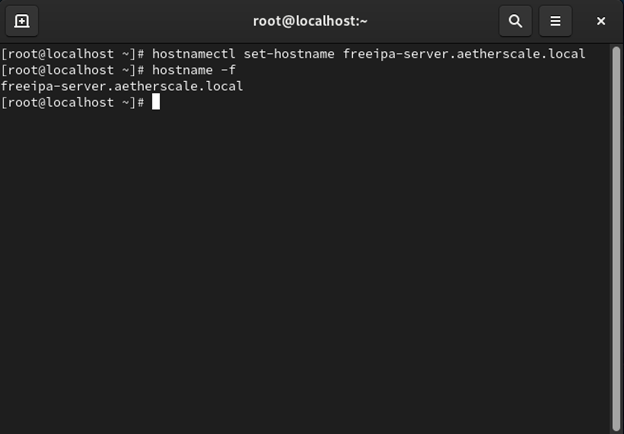

*Figure: Setting the hostname for the FreeIPA server.*

Configure the DNS record on the server as follows:
```bash
sudo nano /etc/hosts
```
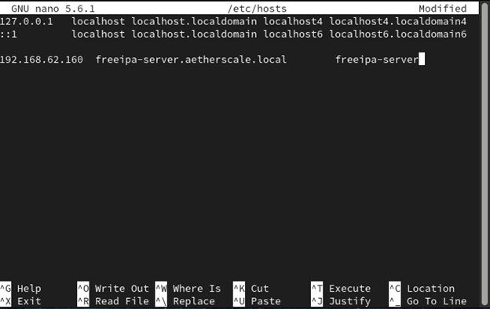

*Figure: Configuring /etc/hosts file with domain entries.*

Use this command to install FreeIPA server on CentOS:
```bash
dnf install freeipa-server freeipa-server-dns -y
```
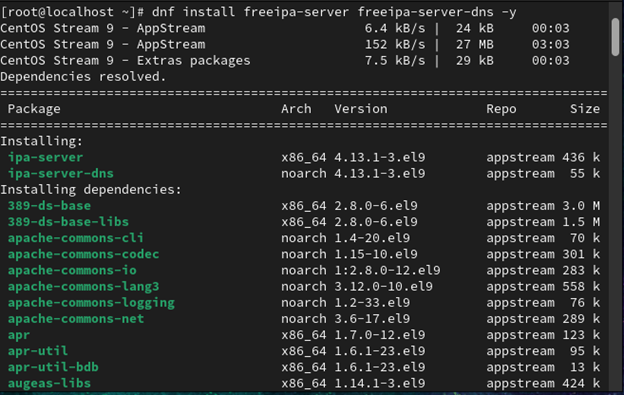

*Figure: Installing FreeIPA server packages on CentOS.*

Run the FreeIPA installation command on CentOS:
```bash
ipa-server-install --setup-dns
```
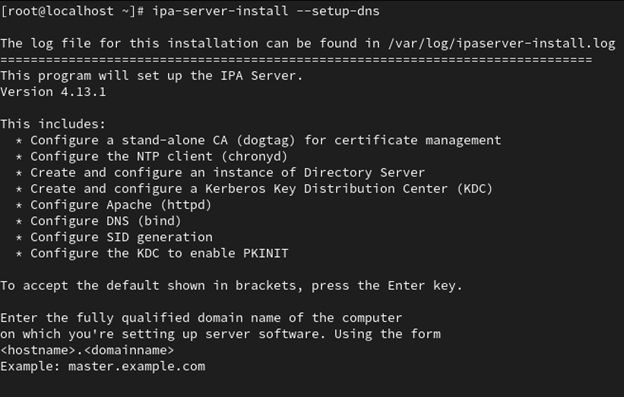

*Figure: Running ipa-server-install command (step 1).*

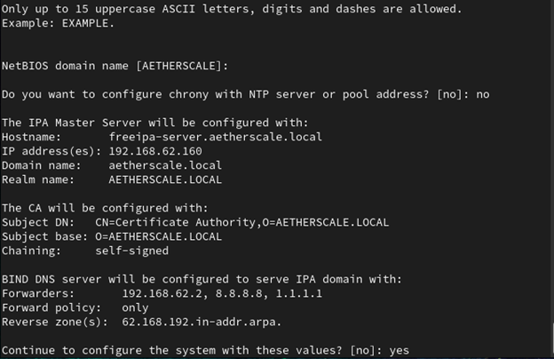

*Figure: FreeIPA server installation progress (step 2).*

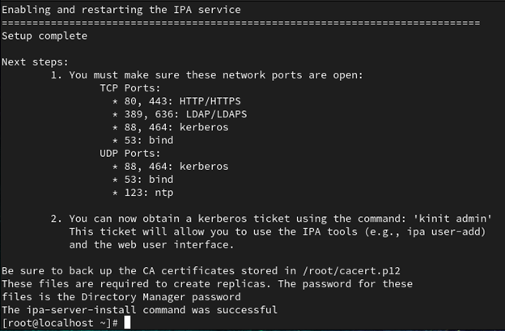

*Figure: Completion of FreeIPA server setup (step 3).*

Access the web interface using this link: https://freeipa-server.aetherscale.local

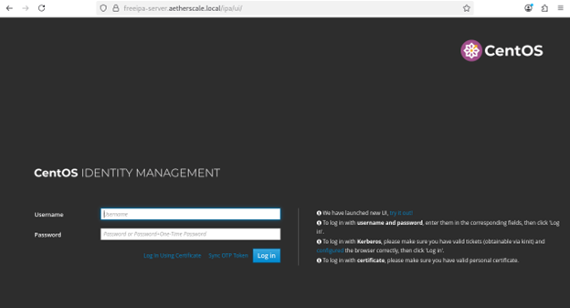

*Figure 2: Accessing the FreeIPA web interface via browser.*

Run this command to log in using the admin account:

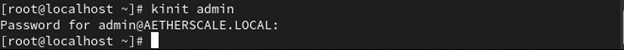

*Figure 3: Authenticating as admin using kinit command.*

This is the default page:

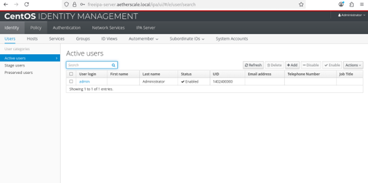

*Figure 4: FreeIPA web GUI dashboard after login.*

### Firewall configuration
```bash
sudo firewall-cmd --add-port={80,443,389,636,88,53}/tcp --permanent
```
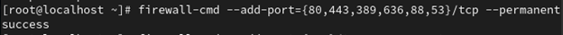

*Figure 5: Adding essential TCP ports to the firewall for FreeIPA services.*

```bash
sudo firewall-cmd --add-port={88,464,53,123}/udp --permanent
```


*Figure 6: Adding UDP ports for Kerberos and DNS services.*

```bash
sudo firewall-cmd --add-service=free-ldap --add-service=freeipa-ldaps --permanent
```
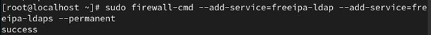

*Figure 7: Enabling LDAP and LDAPS services in the firewall.*

```bash
sudo firewall-cmd --reload
```
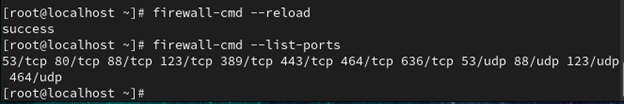

*Figure 8: Reloading the firewall to apply the new rules.*


## Client Enrollment

### Ubuntu Server
1. Add the Ubuntu host DNS record: Run this command on the FreeIPA server
```bash
ipa dnsrecord-add aetherscale.local bbb-server --a-rec 192.168.62.158
```
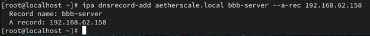

*Figure 9: Adding DNS record for the Ubuntu server in FreeIPA.*

2. Set the hostname:
```bash
sudo hostnamectl set-hostname bbb-server.aetherscale.local
hostname -f
```
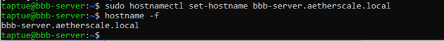

*Figure 10: Setting the hostname on the Ubuntu server.*

3. Update `/etc/hosts` and `/etc/resolv.conf` to use the FreeIPA DNS server.
On Ubuntu, specify the FreeIPA server address as the DNS server.

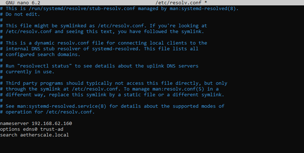

*Figure 11: Configuring /etc/resolv.conf to use FreeIPA as DNS server.*

Edit `/etc/hosts` on Ubuntu:

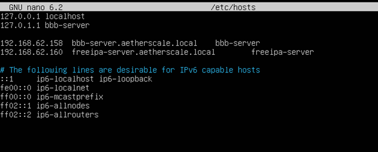

*Figure 12: Editing /etc/hosts file on Ubuntu to include domain entries.*


4. Install and enroll the FreeIPA client:
```bash
sudo apt-get update
sudo apt-get install -y freeipa-client
sudo ipa-client-install
```
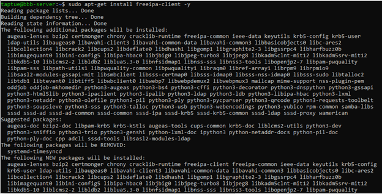

*Figure 13: Installing FreeIPA client packages on Ubuntu.*

Accept the default configuration.

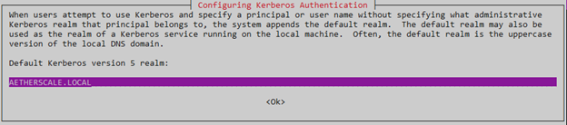

*Figure 14: Authentication prompt during FreeIPA client installation.*

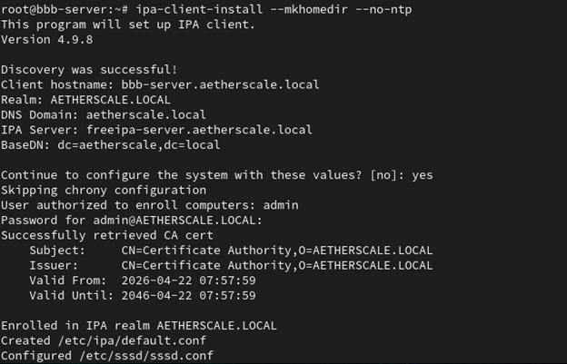

*Figure 15: Successful FreeIPA client configuration on Ubuntu.*


### CentOS Stream 9
1. Install FreeIPA client packages:
```bash
sudo dnf install -y freeipa-client
```
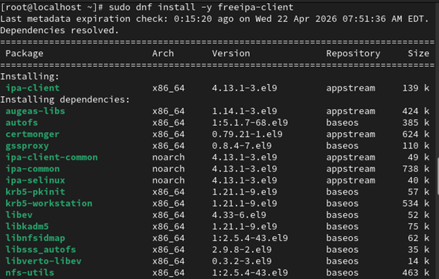

*Figure 16: Installing FreeIPA client on CentOS Stream 9.*

2. Configure the hostname:
```bash
sudo hostnamectl set-hostname centos.aetherscale.local
hostname -f
```

3. Enroll the client with home directory creation:
```bash
sudo ipa-client-install --mkhomedir
```
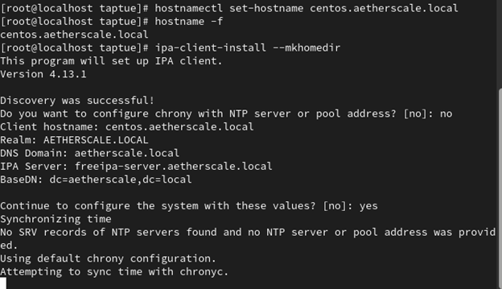

*Figure 17: Enrolling CentOS client with FreeIPA server.*


### Windows 10
1. Register the Windows host in FreeIPA using the web UI or CLI.

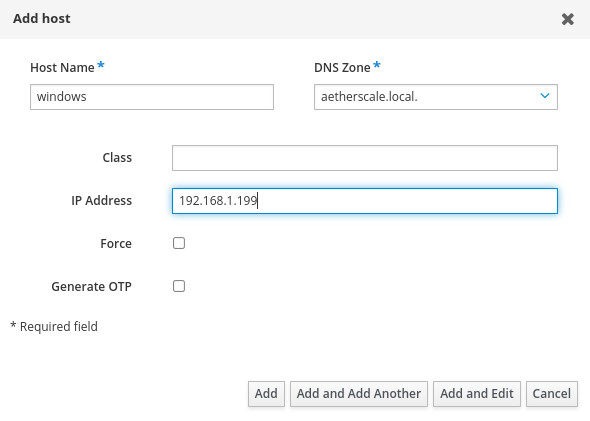

*Figure 18: Adding Windows host to FreeIPA via web interface.*

2. Generate the Windows host keytab on the FreeIPA server:
```bash
sudo ipa-getkeytab -s freeipa-server.aetherscale.local \
  -p host/windows.aetherscale.local \
  -e aes256-cts,aes128-cts,aes256-sha2,aes128-sha2 \
  -k /etc/krb5.keytab -P
```
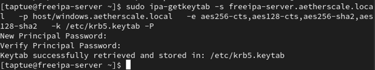

*Figure 19: Generating Kerberos keytab for Windows client.*

```bash
sudo klist -k
```
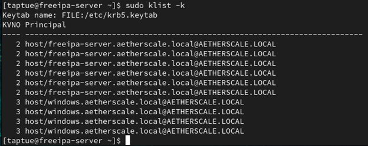

*Figure 20: Listing Kerberos keys to verify keytab creation.*

3. Configure Windows Kerberos domain settings:

Rename the Windows computer:

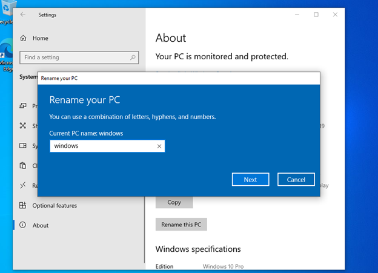

*Figure 21: Renaming the Windows computer to match domain.*

```powershell
ksetup /setdomain AETHERSCALE.LOCAL
ksetup /addkdc AETHERSCALE.LOCAL freeipa-server.aetherscale.local
ksetup /addkpasswd AETHERSCALE.LOCAL freeipa-server.aetherscale.local
ksetup /setcomputerpassword admin123
ksetup /mapuser * *
```
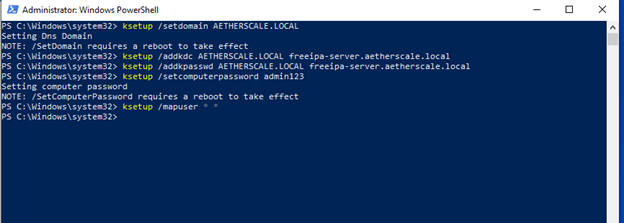

*Figure 22: Configuring Kerberos settings on Windows using ksetup.*

Open Run (Windows + R) and enter: `gpedit.msc`

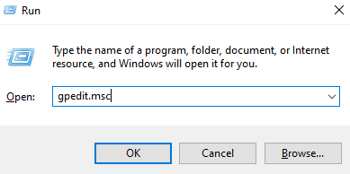

*Figure 23: Opening Group Policy Editor on Windows.*

Navigate to Windows Settings > Security Settings > Local Policies > Security Options > Network Security: Configure encryption types allowed for Kerberos

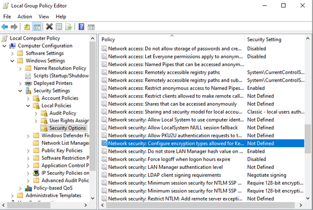

*Figure 24: Navigating to Kerberos encryption settings in Group Policy.*

Enable all supported encryption types except the first two DES options.

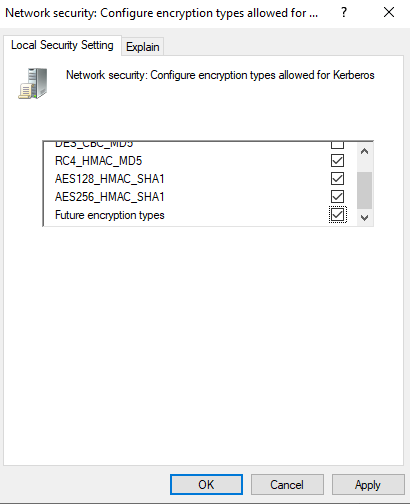

*Figure 25: Enabling supported Kerberos encryption types.*

Reboot the computer:

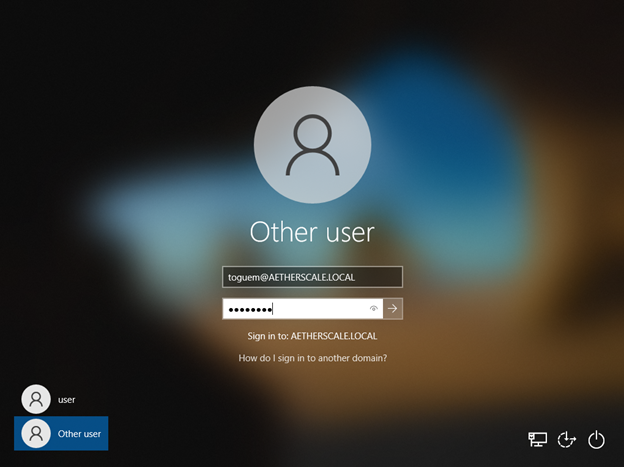

*Figure 26: Windows login screen after reboot.*

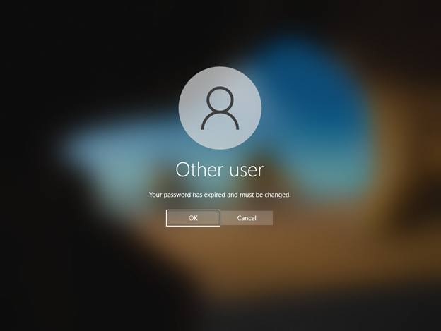

*Figure 27: Selecting domain user for login.*

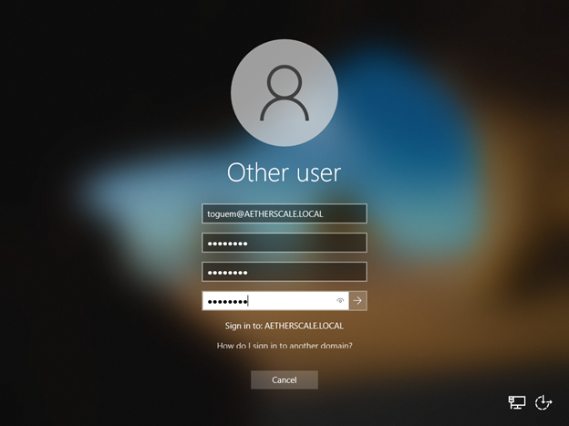

*Figure 28: Entering credentials for domain authentication.*

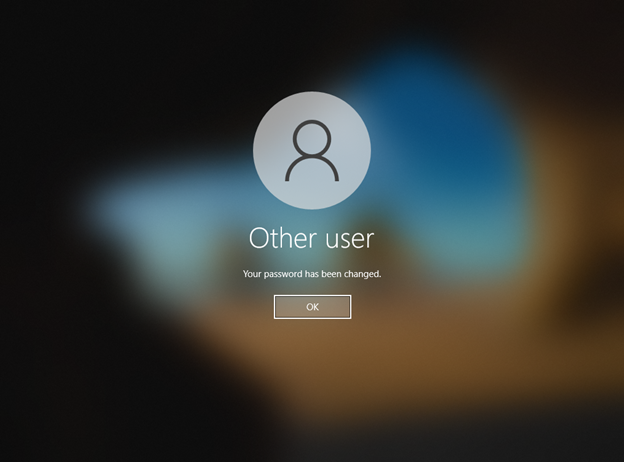

*Figure 29: Successful login to Windows using FreeIPA domain credentials.*

Check the Windows configuration using `ipconfig /all`:

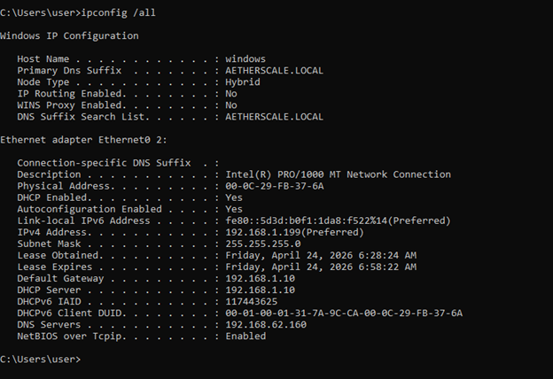

*Figure 30: Verifying network configuration with ipconfig.*

Check the list of hosts in our domain:

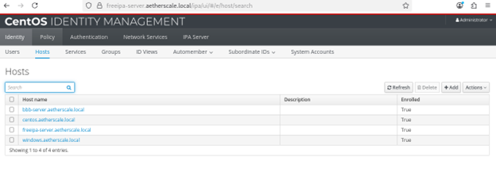

*Figure 31: Viewing enrolled hosts in FreeIPA web interface.*

## Identity Management
### Create users
Use the FreeIPA web UI to create and manage user accounts:
1. Open the FreeIPA web UI.
2. Navigate to `Identity > Users`.
3. Click `Add` and complete the required fields.

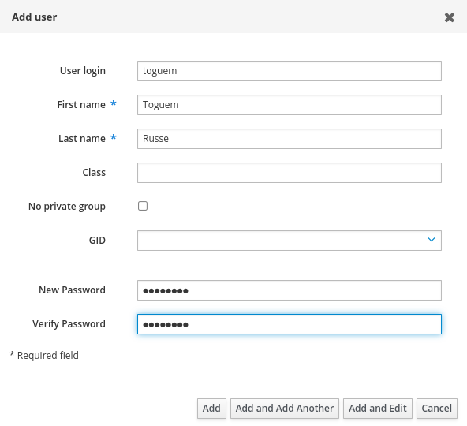

*Figure 32: Adding a new user in FreeIPA web interface.*

### Manage groups
Create groups and assign users.
```bash
ipa group-add junior-devs --desc="Junior Developers"
ipa group-add senior-ops --desc="Senior Operations"
```
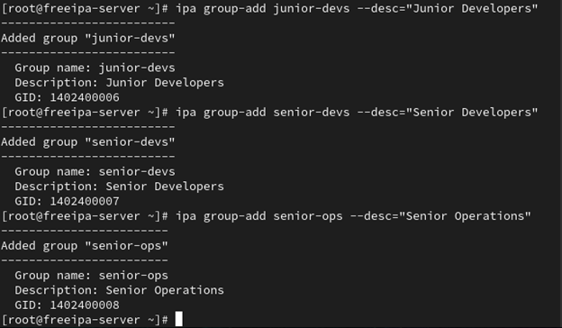

*Figure 33: Creating user groups in FreeIPA.*

```bash
ipa group-add-member junior-devs --users=bakam
ipa group-add-member senior-ops --users=toguem
```
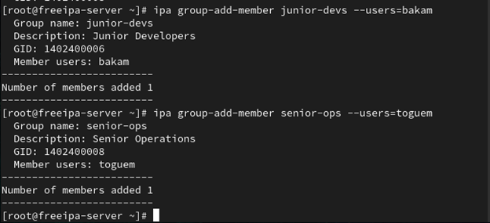

*Figure 34: Assigning users to groups in FreeIPA.*


## Sudo Policy Management
### Define sudo rules
```bash
ipa sudorule-add junior-dev-rule
ipa sudorule-add senior-ops-rule
```
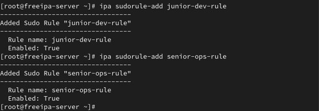

*Figure 35: Creating sudo rules in FreeIPA for different user groups.*

### Junior developers: log read access only
```bash
ipa sudocmd-add "/bin/cat /var/log/*"
ipa sudorule-add-allow-command junior-dev-rule --sudocmds="/bin/cat /var/log/*"
ipa sudorule-add-user junior-dev-rule --groups=junior-devs
```
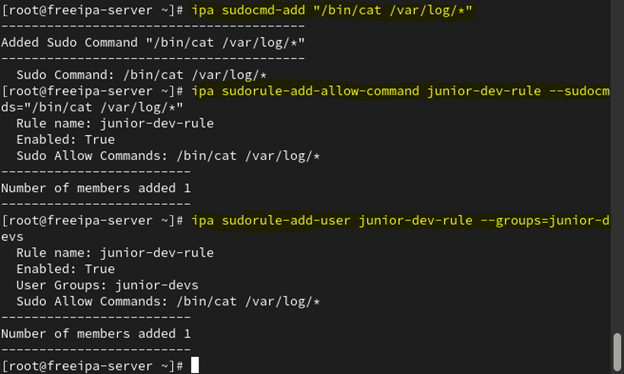

*Figure 36: Adding log read command to junior developer sudo rule.*

### Senior operations: service restart access
```bash
ipa sudocmd-add "/bin/systemctl restart *"
ipa sudorule-add-allow-command senior-ops-rule --sudocmds="/bin/systemctl restart *"
ipa sudorule-add-user senior-ops-rule --groups=senior-ops
```
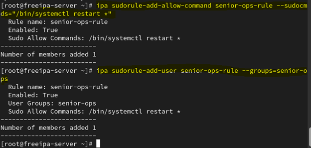

*Figure 37: Adding service restart command to senior operations sudo rule.*


## SSH Key Management
### Generate SSH key pair
```bash
ssh-keygen -t ed25519 -C "bakam@aetherscale.local"
```

### Add public key to FreeIPA
```bash
ipa user-mod bakam --sshpubkey="$(cat ~/.ssh/id_ed25519.pub)"
```
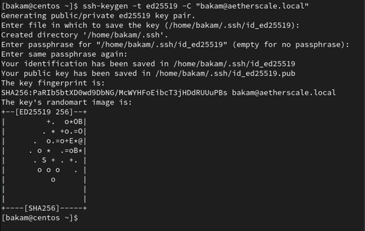

*Figure 38: Adding SSH public key to user profile in FreeIPA.*

Instead of manual copying, attach the public key to the FreeIPA user profile. This ensures that if a user is deleted from FreeIPA, their access is revoked everywhere instantly.

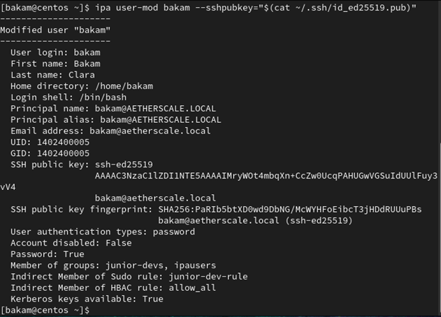

*Figure 39: SSH key attached to user in FreeIPA interface.*


### Configure SSH to use SSSD
Edit `/etc/ssh/sshd_config` and add:
```text
AuthorizedKeysCommand /usr/bin/sss_ssh_authorizedkeys
AuthorizedKeysCommandUser root
PasswordAuthentication no
ChallengeResponseAuthentication no
PubkeyAuthentication yes
UsePAM yes
```
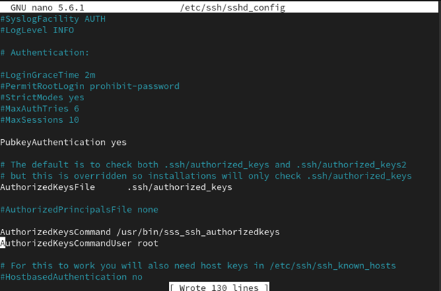

*Figure 40: Configuring SSH daemon to use SSSD for key retrieval.*

### Apply SSH configuration
```bash
sudo sshd -t
sudo systemctl restart sshd
```
Try to connect to the CentOS client; it will succeed without a password but will fail on other servers.

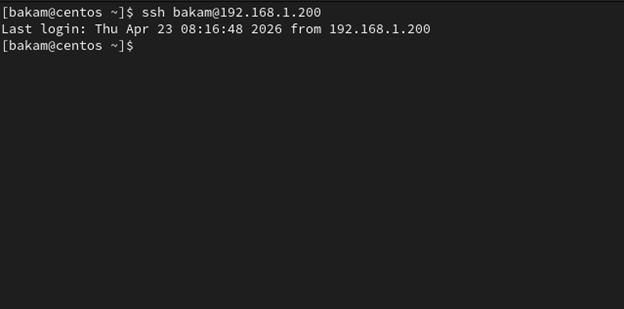

*Figure 41: Successful SSH login using FreeIPA-managed key.*


## Verification
- Confirm hosts are visible in the FreeIPA host inventory.
- Validate user authentication from each client.
- Test sudo access for configured groups.
- Confirm SSH login using FreeIPA-managed keys.

## Contributing
Contributions are welcome! Please fork the repository and submit a pull request with your improvements. For major changes, open an issue first to discuss the proposed changes.

## License
This project is licensed under the MIT License - see the [LICENSE](LICENSE) file for details.

## Notes
- Keep an active administrative session when updating SSH configuration.
- Use both the FreeIPA web UI and CLI for verification.
- Replace example hostnames and domains with values from your own environment.